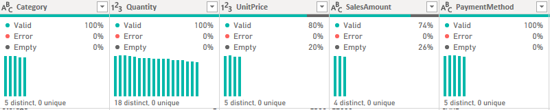
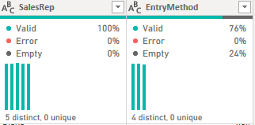
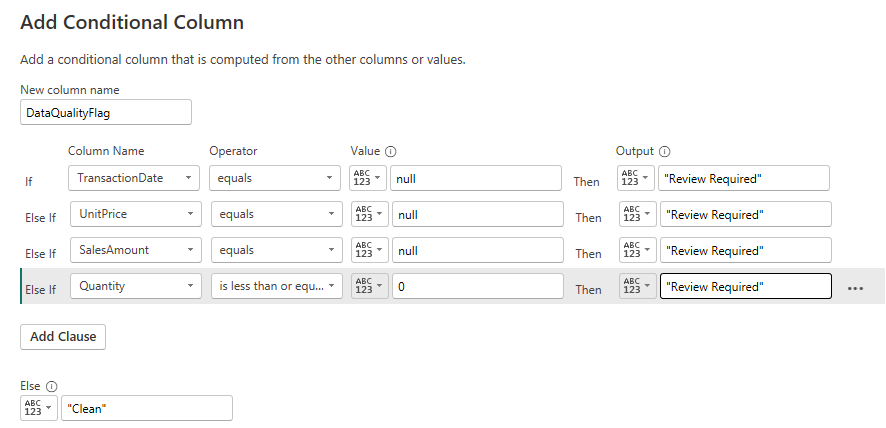
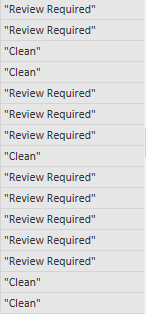

# AfriRetail Power Query Data Preparation
---

## Project Overview
AfriRetail Ltd needed clean, analysis-ready data for sales reporting across East Africa. Raw sales, product, and region data were messy and inconsistent.

---

## Data Preparation Workflow

### 1. Data Ingestion & Staging
- Loaded 3 datasets into Power BI.
- Created staging queries:
  - `Fact_Sales_Staging` (fact table)
  - `Dim_Products_Staging` (lookup)
  - `Dim_Regions_Staging` (lookup)
---

- Screenshot:

---

### 2. Data Profiling & Quality Assessment

After loading the sales data into Power Query, we used built-in profiling tools to identify data quality issues.

#### Steps Performed

1. **Enable Column Profiling**
   - Clicked **View** → Checked:
     - **Column Quality**
     - **Column Distribution**
     - **Column Profile**
   - **Purpose:** To visually inspect which columns contain nulls, errors, or inconsistent data.

---

---

---

---

## Data Quality Issues Identified in Sales Data

- **Missing and inconsistent transaction dates**
  - `TransactionDate` has 202 empty records
  - Multiple date formats detected (e.g. `03-20-2024`, `2024/04/10`)

- **Inconsistent text formatting**
  - Leading/trailing spaces and mixed casing found in:
    - `Country`
    - `Branch`
    - `Category`
    - `PaymentMethod`
    - `SalesRep`
  - Examples: ` kenya` vs `Uganda`, `Manual` vs `manual`

- **Invalid quantity values**
  - `Quantity` contains zero and negative values
  - Minimum value = `-3`
  - Zero-value records = `68`

- **Missing and erroneous numeric values**
  - `Unit Price` has `192` missing values
  - `SalesAmount` has `264` missing values and error entries

---

### **Data Quality Flag Implementation**
**Main Flag Column:**
- **Name:** `DataQualityFlag`
- **Logic:** `IF (TransactionDate = null OR Quantity ≤ 0 OR UnitPrice = null OR SalesAmount = null) THEN "Review Required" ELSE "Clean"`
- **Results:** [2259] Clean records, [3941] Review Required records

---

---

---

**Individual Flag Columns:**
- **Quantity Flag:** `Flag_InvalidQuantity`
  - **Logic:** `IF Quantity ≤ 0 THEN "Invalid" ELSE "Valid"`
  - **Purpose:** Specific identification of quantity issues

---

---

---

**Audit Query Created:**
- **Name:** `Audit_ProblematicRecords`
- **Source:** Reference of `Fact_Sales_Staging`
- **Filter:** `DataQualityFlag = "Review Required"`
- **Count:** [3941] problematic records isolated

---

---

---

