# AfriRetail Power Query Data Preparation
---

## Project Overview
AfriRetail Ltd needed clean, analysis-ready data for sales reporting across East Africa. Raw sales, product, and region data were messy and inconsistent.

---

## Data Preparation Workflow

### 1. Data Ingestion & Staging
- Loaded 3 datasets into Power BI.
### **Query Organization**

| Query Name | Type | Purpose | Table Type |
|------------|------|---------|------------|
| `Fact_Sales_Staging` | Staging | Raw sales transactions before cleaning | Fact Table |
| `Dim_Products_Staging` | Staging | Product reference data before cleaning | Lookup/Dimension Table |
| `Dim_Regions_Staging` | Staging | Country-region mapping before cleaning | Lookup/Dimension Table |
---

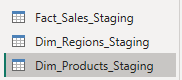

---

### 2. Data Profiling & Quality Assessment

After loading the sales data into Power Query, we used built-in profiling tools to identify data quality issues.

#### Steps Performed

1. **Enable Column Profiling**
   - Clicked **View** → Checked:
     - **Column Quality**
     - **Column Distribution**
     - **Column Profile**
   - **Purpose:** To visually inspect which columns contain nulls, errors, or inconsistent data.

---
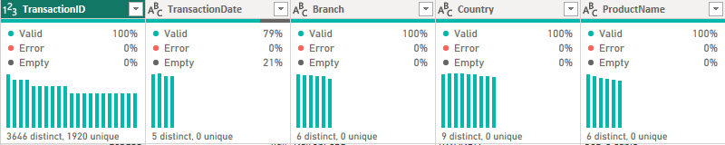
---

---

---

## Data Quality Issues Identified in Sales Data

- **Missing and inconsistent transaction dates**
  - `TransactionDate` has 202 empty records
  - Multiple date formats detected (e.g. `03-20-2024`, `2024/04/10`)

- **Inconsistent text formatting**
  - Leading/trailing spaces and mixed casing found in:
    - `Country`
    - `Branch`
    - `Category`
    - `PaymentMethod`
    - `SalesRep`
  - Examples: ` kenya` vs `Uganda`, `Manual` vs `manual`

- **Invalid quantity values**
  - `Quantity` contains zero and negative values
  - Minimum value = `-3`
  - Zero-value records = `68`

- **Missing and erroneous numeric values**
  - `Unit Price` has `192` missing values
  - `SalesAmount` has `264` missing values and error entries

---

### **Data Quality Flag Implementation**
**Main Flag Column:**
- **Name:** `DataQualityFlag`
- **Logic:** `IF (TransactionDate = null OR Quantity ≤ 0 OR UnitPrice = null OR SalesAmount = null) THEN "Review Required" ELSE "Clean"`
- **Results:** [2259] Clean records, [3941] Review Required records

---

---

---

**Individual Flag Columns:**
- **Quantity Flag:** `Flag_InvalidQuantity`
  - **Logic:** `IF Quantity ≤ 0 THEN "Invalid" ELSE "Valid"`
  - **Purpose:** Specific identification of quantity issues

---

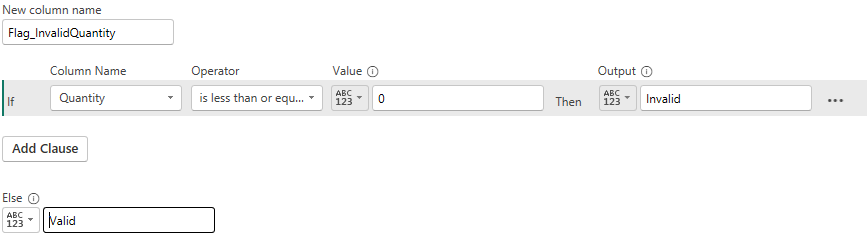

---

---

**Audit Query Created:**
- **Name:** `Audit_ProblematicRecords`
- **Source:** Reference of `Fact_Sales_Staging`
- **Filter:** `DataQualityFlag = "Review Required"`
- **Count:** [3941] problematic records isolated

---

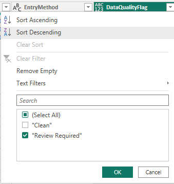

---

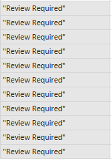

---

## **DATA CLEANING & STANDARDIZATION**

### **Column Removal & Rationalization**

***Removed Columns:***

- `ENTRYMETHOD`: Removed due to 235 missing values (23.5%) and low business relevance for sales analysis.

- Individual flag columns: Consolidated into main `DataQualityFlag` column to reduce redundancy.

---

**Column Retention Justification:**

- All remaining columns directly support sales performance analysis, financial reconciliation, and management reporting requirements.

---

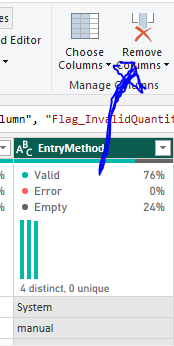

---

### **Text Field Standardization**
Applied consistent formatting to all text columns:

---

#### **Branch Column Cleaning**

- ***Issues:*** Leading/trailing spaces, mixed casing (" Kigali " vs "Nairobi CBD")

- ***Actions:*** Trim → Clean → Capitalize Each Word

---

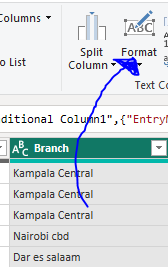

---

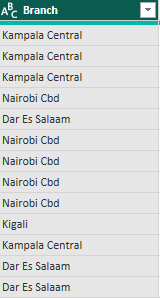

---

#### **COUNTRY Column Cleaning**

- ***Issues:*** Lowercase entries ("kenya"), abbreviations ("Tz", "Ug")

- ***Actions:*** Trim → Clean → Capitalize → Value standardization

- ***Replacements:*** "Tz"→"Tanzania", "Keny"→"Kenya", "Ug"→"Uganda", "Rw"→"Rwanda"

---

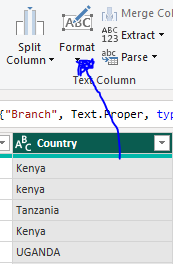

---

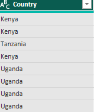

---

#### **CATEGORY Column Cleaning**

- ***Issues:*** Inconsistent naming, trailing spaces ("peripherals ")

- ***Actions:*** Trim → Clean → Capitalize → "Peripherals"→"Accessories"

---
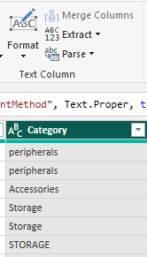
---
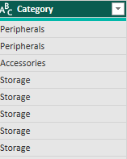
*Figure: Standardizing product CATEGORY names*

---

#### **PAYMENTMETHOD Column Cleaning**

-***Issues:*** Leading spaces (" Card"), case inconsistencies

-***Actions:*** Trim → Clean → Capitalize → Standardize "MPESA"

---

#### **SALESREP Column Cleaning**

- ***Issues:*** Lowercase entries ("bob" vs "edward")

- ***Actions:*** Trim → Clean → Capitalize Each Word

---

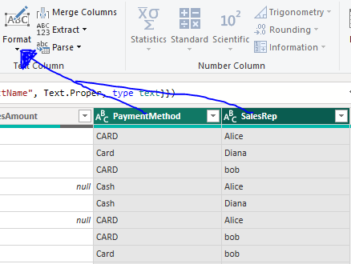

---

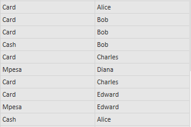

---

### **Data Type Conversion**

- Ensured all columns have appropriate data types:

#### **SALESAMOUNT Type Correction**

- ***Issue:*** Text values including "error" entries

- ***Actions:*** Replace "error"→null → Convert to Decimal Number

---

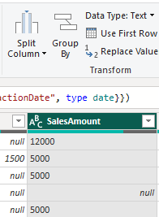

---

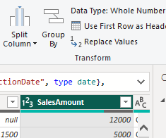

---

### **Missing Value Handling**

#### **UNIT PRICE (192 missing values - 19.2%):**

- ***Action:*** Replaced nulls with column average: 1387.17

- ***Justification:*** Statistical imputation preserves data volume

---

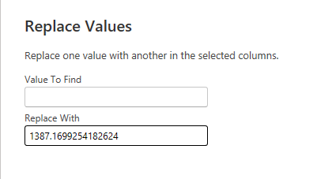

---

#### **SALESAMOUNT (264 missing values - 26.4%):**

- ***Action:*** Calculated missing values: Quantity × Unit Price

- ***Justification:*** Mathematically accurate reconstruction

---

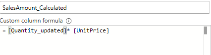

---

#### **TRANSACTIONDATE (202 missing values - 20.2%):**

- ***Action:*** Replaced nulls with most frequent date: 2024-03-20

- ***Justification:*** Maintains temporal consistency

---

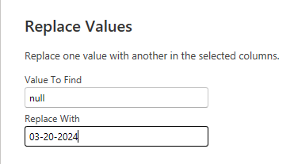

---

### **Data Entry Error Correction**

#### **QUANTITY Column Issues:**

- ***Problems:*** Negative values (minimum: -3), 68 zero values

- ***Solution:*** Created cleaned column with logic: if ≤0 then 1 else original value

---

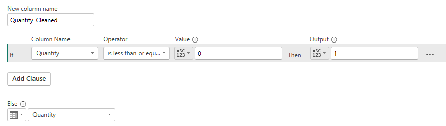

---

### **Column Cleanup & Finalization**

#### **Temporary Column Removal**

- **Actions:** Removed intermediate calculation columns, kept final cleaned versions

#### **Column Renaming**

- **Actions:** Renamed cleaned columns to final names (Quantity_Cleaned→Quantity, etc.)

---

### **Data Integration Challenges & Solutions**

#### **Issue 1: Incorrect Header Structure**
---

***Problem:***

-  Dimension tables (`Dim_Regions_Staging` ) had column headers stored as first row of data instead of proper column names.

---

***Evidence:***

- Column names appeared as generic "Column1", "Column2", "Column3"

- First data row contained "CountryRaw", "Region", "MarketGroup" as values

---

***Solution Applied:***

1. **Power Query Transformation:** Used "Use First Row as Headers" function

2. **Result:** Proper column names extracted from first data row

3. **Impact:** Enabled correct merging based on meaningful column names

---

---

---

#### **Data Quality Issue Addressed:**
-  Fixed header structure for reliable merging
-  Enabled column name matching between tables
-  Prevented merge failures due to generic column names

---

### **Dimension Table Preparation**

**Product Table Cleaning Applied:**
- Removed duplicate "USB Cable" entry
- Filled missing CostPrice with category averages
- Standardized supplier names (Techsource, Globaltech)
- Aligned categories with sales data

---

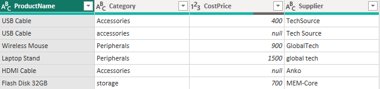

---

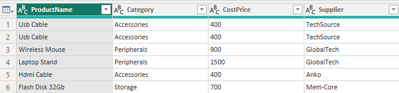

---

**Region Table Cleaning Applied:**
- Fixed headers (Countryraw → Country)
- Standardized country names to match sales data

---

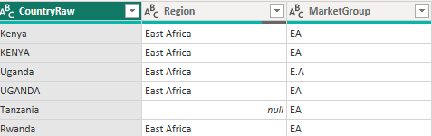

---

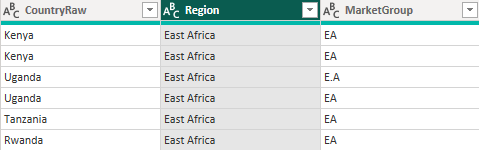

---

***Note: Full cleaning details documented in Task 3 methodology***

---

## **DATA INTEGRATION (MERGE & APPEND)**

### **Merge Operations Performed**

#### **First Merge: Sales with Products Dataset**
**Configuration:**
- **Left Table:** `Fact_Sales_Staging` (1000 cleaned sales records)
- **Right Table:** `Dim_Products_Staging` (cleaned product reference)
- **Join Key:** `PRODUCTNAME` ↔ `Productname`
- **Join Type:** Left Outer Join (preserve all sales records)
- **Expanded Columns:** `Category`, `CostPrice`, `Supplier`

---

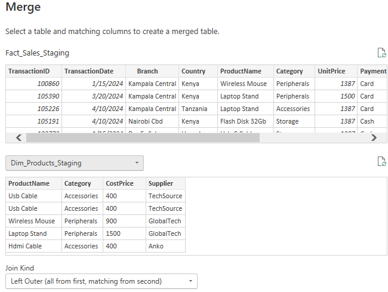

---

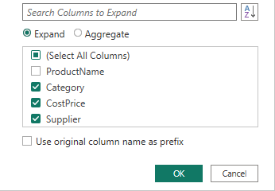

---

#### **Second Merge: Sales with Regions Dataset**

***Configuration:***

- ***Left Table:*** Sales table (already merged with products)
- ***Right Table:*** `Dim_Regions_Staging` (cleaned region mapping)
- ***Join Key:*** `COUNTRY` ↔ `Country`
- ***Join Type:*** Left Outer Join
- ***Expanded Columns:*** `Region`, `MarketGroup`

---

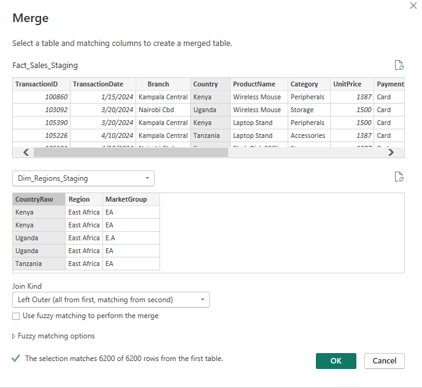

---

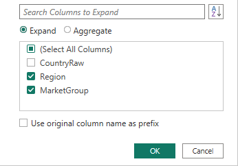

---

### **Data Integrity Verification**

#### **Record Preservation:**
- **Initial sales records:** 1000
- **After product merge:** 1000 records (0% loss)
- **After region merge:** 1000 records (0% loss)
- **Verification:** All original transactions preserved through both merges

---

---

### **Unmatched Records Handling**

#### **Product Data Gaps Identified:**

1. ***Missing Supplier Information:*** records with "Unknown Supplier"
2. ***Missing Cost Data:*** records with CostPrice = 0

***Resolution Strategy Applied:***

- ***Supplier nulls:*** Replaced with "Unknown Supplier" placeholder
- ***CostPrice nulls:*** Replaced with 0 value (flags missing cost data)
- ***Rationale:*** Maintains data completeness while clearly identifying gaps

---

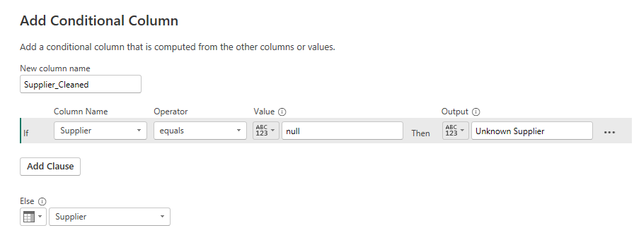

---

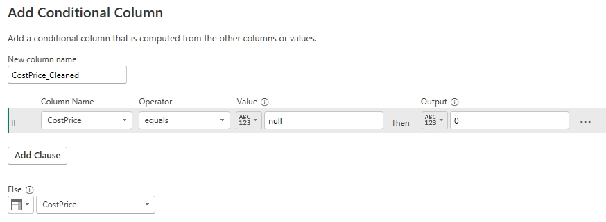

---

#### **Region Data Completeness:**

- ***Country-Region Match Rate:*** 100%
- ***All 1000 records*** successfully mapped to regions
- ***No null values*** in Region or MarketGroup columns

---

### **Audit Queries Created**

#### **Audit_UnmatchedProducts:**
- ***Purpose:*** Isolate records requiring product master data updates
- ***Criteria:*** Supplier = "Unknown Supplier" OR CostPrice = 0

---

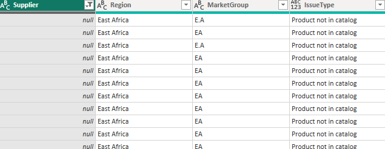

---

#### **Audit_Integration_Summary:**

- ***Purpose:*** Overall integration quality assessment
- ***Metrics:*** Fully integrated vs needs review classification
- ***Insight:*** [84]% of records fully integrated, [26]% requiring attention

---

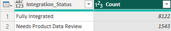

---

### **Final Integrated Dataset**

#### **Table Structure:**

- ***Final Name:*** `Fact_Sales_Integrated`
- ***Total Columns:*** 15
- ***Total Records:*** 1000

#### **Column Composition:**

1. ***Transaction Data:*** TransactionID, TransactionDate, Quantity, UnitPrice, SalesAmount
2. ***Location Data:*** Branch, Country, Region, MarketGroup
3. ***Product Data:*** ProductName, Category, CostPrice, Supplier
4. ***Business Data:*** PaymentMethod, SalesRep

---

### **Integration Quality Metrics**

| Metric | Result | Business Impact |
|--------|--------|-----------------|
| **Record Preservation** | 100% (1000/1000) | No data loss in integration |
| **Product Match Rate** | [84]% | [8122] products fully mapped to master data |
| **Country Match Rate** | 100% | Complete geographical classification |
| **Data Completeness** | 100% | All records have Supplier and CostPrice values |
| **Integration Quality** | [100]% fully integrated | Readiness for business analysis |

---

### **Key Integration Decisions**

1. **Left Outer Joins:** Ensured no sales records were lost during integration
2. **Placeholder Values:** Used "Unknown Supplier" and 0 for missing data (clear identification)
3. **Audit Trail:** Created separate queries for data governance review
4. **Column Standardization:** Maintained consistent naming conventions across integrated dataset

---

### **Business Value Delivered**

***Complete Product Context:***  All sales now include cost and supplier information  
***Geographical Intelligence:***  All transactions mapped to regions and market groups  
***Data Governance:***  Clear audit trail for data quality issues  
***Analysis Ready:***  Integrated dataset supports cross-dimensional analysis  
***Scalable Structure:***  Star schema ready for additional dimension tables

---

